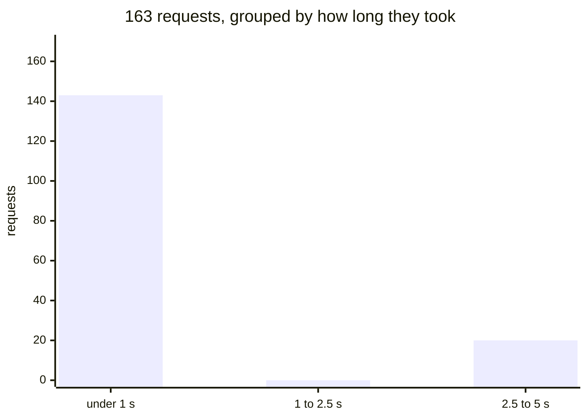
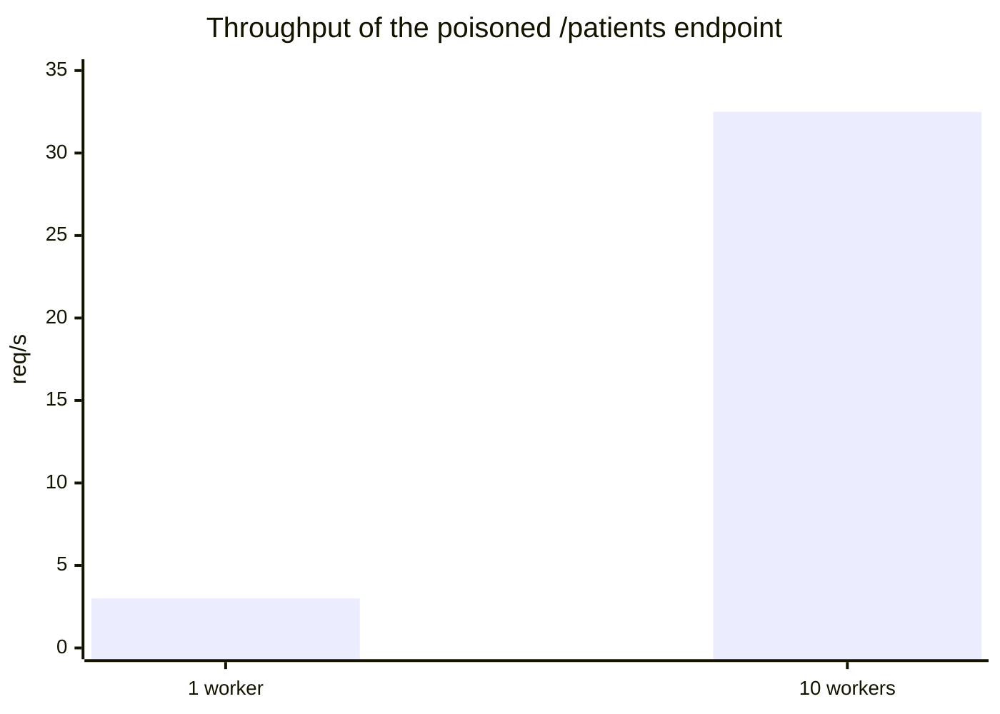
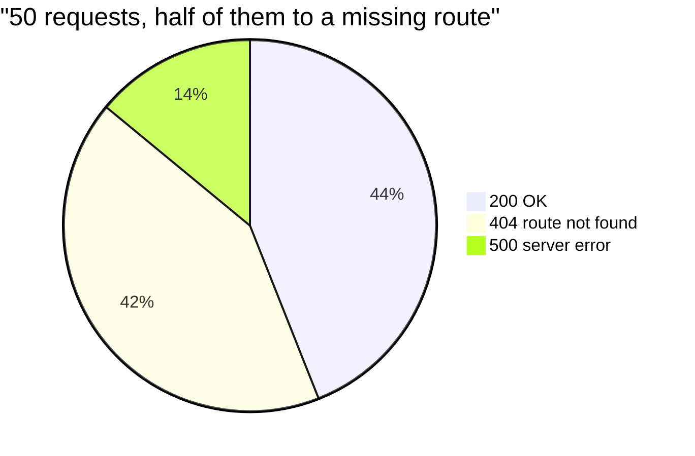
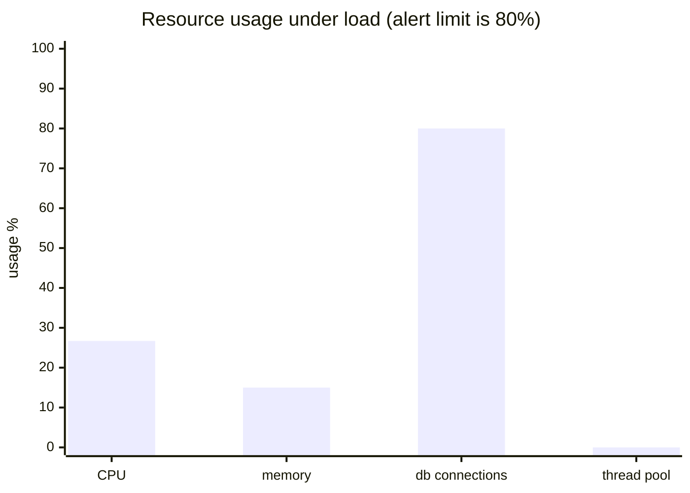

<div align="center">

# Observability, Part 5

**Why your p95 looks nothing like your average**

[](https://dotnet.microsoft.com/)
[](https://www.python.org/)
[](../../LICENSE)

</div>

This lab is a small, runnable example of one idea: **the average hides slow requests.**

You get a tiny .NET API with four endpoints and four Python scripts that hammer them
with requests. Run the scripts, read the numbers, and you will see with your own eyes
why dashboards show percentiles (p95) instead of averages, and why throughput, error
rate, and saturation each tell their own story.

No monitoring vendor, no dashboard, no cloud. Just `dotnet run`, one Python script, and
raw numbers.

> **Repo layout:** this lab lives at `labs/observability/part5-metrics` on the `main`
> branch. Run it from its own folder: `cd labs/observability/part5-metrics`, then the
> commands below. From the repo root you can also run
> `dotnet run --project labs/observability/part5-metrics`.

## Table of contents

- [What you will learn](#what-you-will-learn)
- [The one idea: why the average lies](#the-one-idea-why-the-average-lies)
- [Terms you will meet](#terms-you-will-meet)
- [The API: four endpoints, one metric each](#the-api-four-endpoints-one-metric-each)
- [The raw data: reading a histogram](#the-raw-data-reading-a-histogram)
- [The load tests](#the-load-tests)
- [Getting started](#getting-started)
- [What the numbers actually say](#what-the-numbers-actually-say)
- [Quick tips](#quick-tips)
- [License](#license)

## What you will learn

- What a **latency histogram** is and how to read one.
- Why an **average** can look healthy while 1 in 20 users waits 3 seconds.
- Why **throughput** depends on how many requests you send at once.
- Why an **error rate** is meaningless without the status codes behind it.
- What **saturation** is, and why it warns you before latency does.

## The one idea: why the average lies

Imagine 100 requests: 99 take 1 ms, one takes 3000 ms.

- The average = (99 × 1 + 3000) / 100 ≈ **31 ms**. Looks healthy.
- But one real user just waited **3 seconds**.

The average mixes everyone together, so a few slow requests get diluted by many fast
ones. A **percentile** instead sorts the requests from fastest to slowest and picks the
one at a position:

- p50 = the middle request.
- p95 = the request at position 95%: 95% of requests finished at or below this value.

A percentile cannot be diluted, because it is one request picked from the sorted list,
not a sum divided by a count. That is the whole point of this lab, reproduced in about
ten minutes.

## Terms you will meet

| Term | Simple meaning |
| --- | --- |
| endpoint, route | a URL the API answers, e.g. `GET /patients/1` |
| request | one call from a script to the API |
| histogram | a table that counts how many requests finished in each time range |
| bucket (`le`) | one row of that table. `le="1000"` counts requests that finished in ≤ 1000 ms |
| percentile | the value at position N% of the sorted data. p95 = "95% of requests were this fast or faster" |
| concurrency, workers | how many requests run at the same time |
| RED | the classic metric set: **R**ate (requests per second), **E**rrors (how many fail), **D**uration (how long) |
| saturation | how full the server's resources are (CPU, memory, connections) |
| gauge | a single number showing the current value, like a fuel gauge |
| scrape | reading `/metrics`. Prometheus-style tooling does this on a timer |

## The API: four endpoints, one metric each

Every monitoring dashboard shows the same few numbers: latency, throughput, error
rate, and saturation (the first three are the RED set). This API has one endpoint per
metric, so each metric can be studied in isolation, like a controlled experiment.

| Route | Metric | What it does |
| --- | --- | --- |
| `GET /patients/{id}` | latency | `id 1` sleeps 3 seconds, every other id answers instantly |
| `GET /orders/{id}` | error rate | every 5th id answers with a real `500` error |
| `GET /products/{id}` | throughput | always fast, never errors, so only raw speed matters |
| `GET /batch/{id}` | saturation | only 4 requests run at once, extras queue up; each runs 50 ms of real CPU work and borrows one of five simulated database connections |

The trick is the **poisoned id**: `/patients/1` is a normal request except it costs 3
seconds. How often that id shows up in your test traffic decides whether the average or
the percentile exposes it.

All four endpoints record their time into the same histogram, tagged with a `route`
label, so a single `/metrics` scrape shows all four side by side.

## The raw data: reading a histogram

Each endpoint times itself with a `Stopwatch` and records the result into a histogram:

```csharp
var meter = new Meter("PatientApi");

var latency = meter.CreateHistogram<double>(
    "request.duration",
    unit: "ms",
    description: "Time taken to answer a patient request");
```

`Meter` and `Histogram` are built into .NET (`System.Diagnostics.Metrics`), so no
third-party library is needed. Two lines of OpenTelemetry subscribe the SDK and expose
the data at `GET /metrics`:

```csharp
builder.Services.AddOpenTelemetry()
    .WithMetrics(metrics => metrics
        .AddMeter("PatientApi")
        .AddPrometheusExporter());
```

Scrape it with `curl http://localhost:5120/metrics`. This sample was captured after 163
requests, 20 of them the poisoned id (a real scrape has more buckets; these are the
interesting lines):

```text
request_duration_milliseconds_bucket{route="/patients/{id}",le="1000"} 143
request_duration_milliseconds_bucket{route="/patients/{id}",le="2500"} 143
request_duration_milliseconds_bucket{route="/patients/{id}",le="5000"} 163
request_duration_milliseconds_sum{route="/patients/{id}"} 60013.478199999998
request_duration_milliseconds_count{route="/patients/{id}"} 163
```

`le` means "less than or equal to". Each bucket line is a running total: how many
requests finished in that many milliseconds or fewer. The math, step by step:

- `count = 163` requests in total.
- `le="1000"` = 143, so 143 requests finished in under 1 second.
- The last bucket always catches everything (163), so 163 - 143 = **20 requests took
  longer than a second**: the poisoned ones, about 3 s each.
- average = `sum / count` = 60013 / 163 ≈ **368 ms**.
- p95 = the request at position `ceil(0.95 × 163)` = `ceil(154.85)` = the **155th
  fastest**. Sorted from fast to slow, the fast requests fill positions 1 to 143, the
  slow ones 144 to 163, so the 155th is one of the slow ones: p95 ≈ **3000 ms**.

Same data, two stories: the average says "healthy", the p95 says "1 in 20 users waits
3 seconds". The gap between them (p95 / average ≈ 8x) is itself the diagnostic: a
healthy service has p95 only slightly above the average, a big gap means a poisonous
tail.

Saturation is a different instrument shape: four **gauges**, one per resource, each
reporting the current 0-100% value on every scrape:

```text
# TYPE saturation_cpu_percent gauge
saturation_cpu_percent{otel_scope_name="PatientApi"} 26.3
saturation_memory_percent{otel_scope_name="PatientApi"} 15.0
saturation_db_connections_percent{otel_scope_name="PatientApi"} 80.0
saturation_thread_pool_percent{otel_scope_name="PatientApi"} 0.04
```

A full `/metrics` page mixes these with the histograms and metadata, so filter it
before reading:

```bash
curl -s http://localhost:5120/metrics | grep '^saturation_'
```

## The load tests

One Python script per metric, in [`loadtests/`](loadtests/), so each one stays short:

| Script | Metric | Default target | Question it answers |
| --- | --- | --- | --- |
| `loadtests/latency.py` | Duration | `/patients/{id}` | How bad is the worst case? Which percentile exposes the poisoned id? |
| `loadtests/throughput.py` | Rate | `/patients/{id}` | How many requests per second, at a given concurrency? |
| `loadtests/error_rate.py` | Errors | `/orders/{id}` | What fraction of calls fail, and with which status codes? |
| `loadtests/saturation.py` | Saturation | `/batch/{id}` | How full are CPU, memory, db connections, and the thread pool, right now? |

The scripts measure from the outside, which is how a real monitoring tool sees your
service. Each defaults to the endpoint that makes its metric visible, and the last
argument can point any script at any route.

All four take the same arguments in the same order:

```bash
python loadtests/<script>.py [base_url] [num_requests] [id_range] [extra_knob] [path]
```

| Position | Default | Meaning |
| --- | --- | --- |
| 1 `base_url` | `http://localhost:5120` | where the API is listening |
| 2 `num_requests` | `100` | how many calls to make |
| 3 `id_range` | `100` | ids are drawn from `0..id_range-1`. This controls how often the poisoned `id 1` appears |
| 4 | varies | a per-script knob, see below |
| 5 `path` | per-script | the route to hammer, e.g. `/patients` or `/products` |

Argument 3 is the knob that makes the latency trick work: the poisoned id only shows
up at p95 when it is a big enough slice of the traffic. See
[what the numbers actually say](#what-the-numbers-actually-say).

The per-script fourth argument:

- `latency.py`: none. It always sends one request at a time, which keeps the latency
  measurement clean.
- `throughput.py`: `workers`, how many requests are in flight at once (default `1`).
  This argument turns throughput from a side note into the headline.
- `error_rate.py`: `missing_fraction` (`0.0` to `1.0`, default `0.0`). That share of
  requests goes to a route that does not exist, so the server answers `404` on top of
  the `/orders` endpoint's genuine `500`s.
- `saturation.py`: `workers` (default `20`), the concurrency that pushes the `/batch`
  endpoint while the script scrapes the resource gauges.

## Getting started

Prerequisites: the .NET 10 SDK and Python 3 with the `requests` package.

```bash
pip install requests
```

```bash
# Terminal 1: run the API
dotnet run

# Terminal 2: run the load tests
python loadtests/latency.py http://localhost:5120 100 10
python loadtests/throughput.py http://localhost:5120 100 10 10
python loadtests/throughput.py http://localhost:5120 100 100 10 /products   # clean rate, no poison
python loadtests/error_rate.py http://localhost:5120 50 100 0.5
python loadtests/saturation.py http://localhost:5120 60 100 4
python loadtests/saturation.py http://localhost:5120 60 100 20

# Terminal 3: see the saturation gauges, server side
curl -s http://localhost:5120/metrics | grep '^saturation_'
```

Each script prints one line per request, then a summary. A latency run with ids `0..9`
produces roughly this:

```text
requests:    100
average:     241.0 ms
p50:           0.8 ms
p95:        3001.2 ms
p99:        3002.9 ms
max:        3008.8 ms
slow calls: 11 (>= 3000 ms)
```

## What the numbers actually say

### Latency: 10% poison vs 1% poison

Two real runs of the same endpoint. Both are correct measurements; they just look very
different.

With ids drawn from `0..9`, the poisoned id is about 10% of traffic:

```text
requests:   100
average:    241.0 ms
p95:       3001.2 ms
```

The average looks fine. The p95 exposes the stall. An average alone would have said
"healthy".

With ids drawn from `0..99`, the poisoned id is about 1% of traffic (500 requests, 9
slow calls):

```text
requests:   500
average:     55.0 ms
p95:          4.0 ms
max:       3002.7 ms
```

Now even the p95 hides it: the nine slow calls sit beyond the 95th position in the
sorted list, so they never get picked. Only p99 or the max reveal them.

The same 163 requests from the histogram sample, grouped by how long they took:



The bar is what the histogram says: almost everything is instant, then a spike far to
the right. The average stands in the tall bar's shadow; the p95 is standing in the
spike.

That contrast is the real lesson: **a percentile only shows the tail you include in
your view.** A 10% tail needs p95. A 1% tail needs p99. Change `id_range` and watch
which number lights up.

### Throughput: the workers argument changes the story

Same target route (`/patients`), same 100 requests, same ids `0..9` (about 10 poisoned
calls). The only difference is how many requests are in flight at once:

```text
# 1 worker (requests sent one after another)
duration:   33.11 s
throughput:   3.0 req/s

# 10 workers (10 requests at once)
duration:    3.08 s
throughput:  32.5 req/s
```

Ten times the workers, ten times the request rate. The math:

- throughput = `num_requests / duration`, and `duration` is set by the bottleneck, not
  by the server.
- **1 worker:** the 10 poisoned requests pay their 3 s one after another, so the stalls
  alone cost 10 × 3 s = 30 s, plus the fast ones: 33.11 s total. Throughput =
  100 / 33.11 ≈ **3.0 req/s**.
- **10 workers:** the 10 stalls overlap in time, so the whole batch finishes in about
  one stall: 3.08 s total. Throughput = 100 / 3.08 ≈ **32.5 req/s**.
- Speedup = 32.5 / 3.0 ≈ 10.8x, matching the workers ratio (10x). The stall is the
  serial part of the work; concurrency decides how many times you pay it.

The same runs, as bars:



The lesson: **a request rate is meaningless without the concurrency it was measured
at.** This endpoint sustains 3 req/s for a single user and 32 req/s when ten users
arrive together. A dashboard that shows one without the other shows half a story. Run
`python loadtests/throughput.py http://localhost:5120 100 100 20` (rare poison, twenty
workers) to see the same endpoint act far healthier, which is exactly how a dashboard
gets fooled between peaks.

Point it at `/products` and the stall disappears. That is the control experiment:

```text
# 1 worker,  /patients (poisoned)      # 1 worker,  /products (clean)
throughput:   3.0 req/s                 throughput: 1182.2 req/s
# 10 workers, /patients (poisoned)      # 10 workers, /products (clean)
throughput:  32.5 req/s                 throughput: 1237.4 req/s
```

The math, again:

- No stall means nothing to overlap, so the bottleneck is now the round trip: each
  request costs 1 / 1182.2 ≈ **0.85 ms**.
- 10 workers barely move it: 1237.4 / 1182.2 ≈ 1.05x, a 5% gain. The same argument
  gave the poisoned endpoint 10.8x.
- The bottleneck decides the return on concurrency: adding workers grows throughput
  only until you hit the next bottleneck.

It was never the server that was slow; it was the stall, and only concurrency at the
stall made throughput collapse.

### Error rate: an error is not always a crash

The `/orders` endpoint really fails: every 5th id answers `500`. The RED "E" line moves
on its own:

```text
python loadtests/error_rate.py http://localhost:5120 50 100 0

requests:  50
successful: 41
errors:      9
error rate: 18.00%
by status:  {200: 41, 500: 9}
```

These `500`s are also visible on the server, as a separate
`route="/orders/{id}"` histogram in `/metrics`.

Blend in requests to a route that does not exist, and a third kind of error appears
next to the genuine `500`s:

```text
python loadtests/error_rate.py http://localhost:5120 50 100 0.5

requests:  50
successful: 22
errors:     28
error rate: 56.00%
by status:  {200: 22, 404: 21, 500: 7}
```

The same run, as a pie:



Two habits matter here:

1. **Count every non-2xx status.** A `404` from a typo'd URL is an error your users
   feel too, even though nothing crashed.
2. **Read the status breakdown.** It tells you what the red line means: `404` = bad
   route, `500` = server broke, `0` (connection failure) = server gone. The same red
   line, three different investigations.

### Saturation: the early warning that looks like nothing is wrong

Saturation is not measured from the client. It answers "how full are the resources
right now": CPU, memory, db connections, and thread pool. The server exposes each as a
gauge, and `saturation.py` pushes 60 requests at `/batch` (four concurrent slots of
50 ms of real CPU work each, each borrowing a connection from the simulated pool of
five) while scraping `/metrics` every 0.2 seconds. Real run:

```text
python loadtests/saturation.py http://localhost:5120 60 100 20

resource usage right now      limit 80%
----------------------------------------
CPU                         26.7%  ##........
memory                      15.0%  #.........
db connections              80.0%  ########..  <-- limit
thread pool                  0.0%  ..........
```

The same readings, as bars:



At rest, the same process reads: CPU under 0.1%, memory 15.0%, db connections 0%,
thread pool 0.04%. Under load, the db pool sits exactly on the 80% alert limit (four
slots of five connections) and CPU climbs to about 27%. Meanwhile the `/batch` latency
numbers look fine: tens of milliseconds, no errors, healthy throughput. Nothing about
the request numbers says "problem".

That is the point: **high saturation today, even with normal latency, is often
tomorrow's outage.** A dashboard showing only latency and error rate would shrug at
this exact moment; the saturation line is the one that said "you are at the limit"
first. Run the script yourself and watch the `db connections` line sit on the 80%
limit while every latency number stays green.

## Quick tips

- **Saturation is server side, and it is not per-request.** The gauges are read at
  scrape time. Latency can be fine while they sit at their limit, and that gap is the
  early warning. Alert on the gauges, not on the request numbers.
- **Throughput needs its concurrency stated.** "The API does N req/s" is a lie unless
  it says how many requests were in flight. The `/products` control barely moves
  (1182 to 1237 req/s) while the poisoned endpoint swings 3 to 32.
- **Load-test latency is the worst case, not the user experience.** With 10 workers
  the max latency is still ~3 s, but a real user almost never sees the whole queue
  behind it.
- **The poison rate decides which percentile catches it.** 10% shows at p95. 1% needs
  p99. Real dashboards have the same problem: pick the percentile that covers the tail
  you care about.
- **The first request of a run is slow no matter what.** A cold connection adds tens
  to hundreds of milliseconds before the delay is even involved. Warm up once before
  judging numbers.
- **The average and p95 are computed client side, deliberately.** The point is to show
  the measurement a monitoring tool would make, not the server's own timers.
- **Random means non-deterministic.** With ids `0..99` and 100 requests, `id 1` appears
  in only about 37% of runs. Run a bigger batch or narrow the range to make the effect
  show up reliably.
- **The `requests` package is the only Python dependency.** Everything else is the
  standard library, so the scripts stay readable for people who have never seen a load
  test before.

## License

[GPL-3.0](../../LICENSE)
